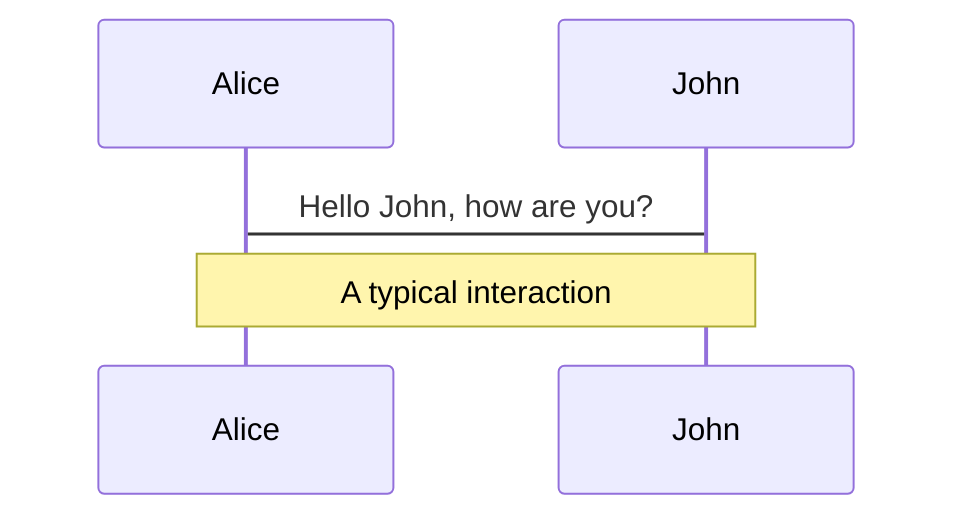
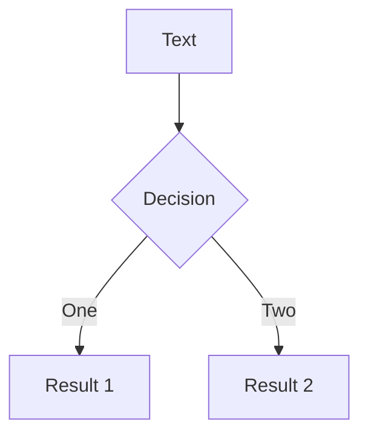
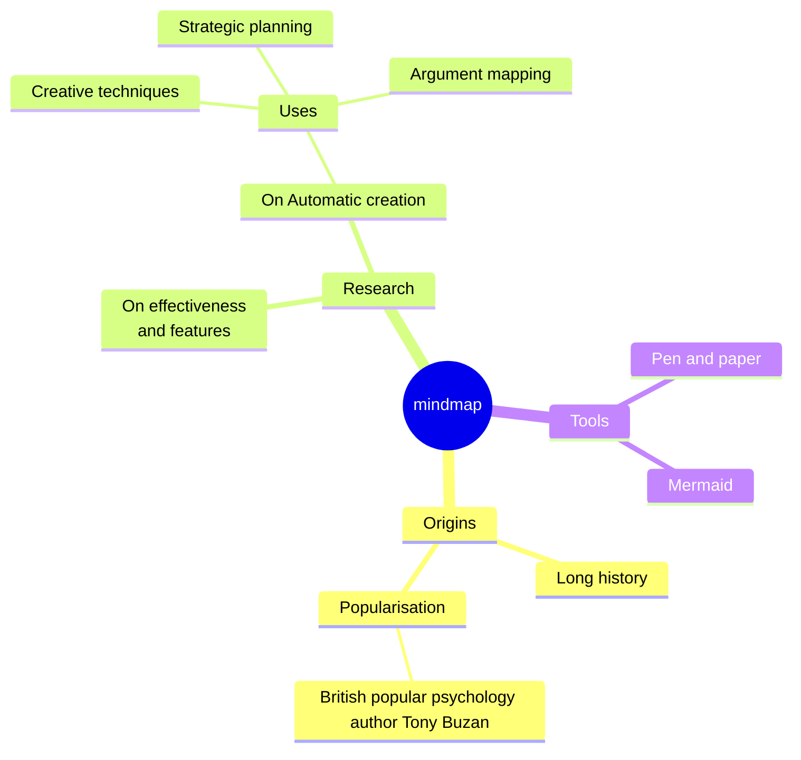
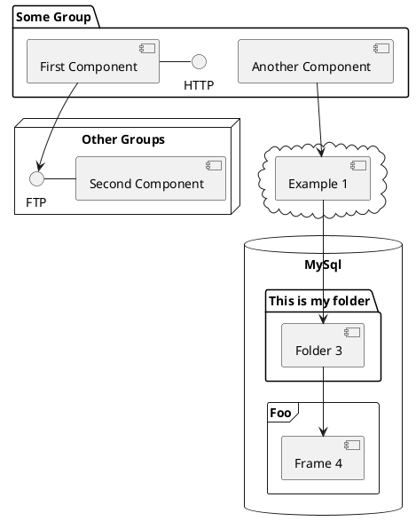

# <span class="text-green-600">Vue.js</span> 学習の振り返り<carbon-logo-vue />
<div>
  <span class="mr-6">2024/10/22</span>
  <span>hiro</span>
</div>
<div class="abs-br m-6 flex gap-0">
  <a href="https://x.com/hiro_xre" target="_blank" alt="GitHub" title="Open in X"
    class="text-xl slidev-icon-btn opacity-50 !border-none !hover:text-white">
    <carbon-logo-x />
  </a>
  <a href="https://github.com/xrealizex" target="_blank" alt="GitHub" title="Open in GitHub"
    class="text-xl slidev-icon-btn opacity-50 !border-none !hover:text-white">
    <carbon-logo-github />
  </a>
</div>

---
transition: fade-out
hideInToc: true
---

# アジェンダ

<Toc />

---
transition: fade-out
---

<Title title="はじめに" tag="h1" />
<div class="mt-10">
  <p>Vue.jsの学習を振り返り......</p>
  <p>どのような学習したか</p>
  <p>どのようなことがあったか</p>
  <p>について話していきます</p>
  <p>少しでも参考になるものがあれば幸いです！</p>
</div>

---
transition: fade-out
---

<Title title="チュートリアル" tag="h1" />

https://ja.vuejs.org/tutorial/#step-1

実はチュートリアルのはじめに大事なことが書いてありました
> このチュートリアルの目的はブラウザーで Vue で作業することがどのような感じなのかいち早く体験してもらうことです。網羅的な内容を目指すものではないため、すべてを理解してから次に進む必要はありません。しかしながら、すべてを完了したあと、各項目についてより詳しく説明しているガイドを必ずお読みください。

ここで大事な部分は
> すべてを完了したあと、各項目についてより詳しく説明しているガイドを必ずお読みください。

です

**ガイド**読んでいますか？

---
transition: fade-out
layout: image
image: ./public/images/computed.png
---

---
transition: fade-out
layout: image
image: ./public/images/computed-guide.png
---

---
transition: fade-out
hideInToc: true
---

<Title title="つまり？" tag="h1" />


何が言いたいかというと...

今からでもチュートリアル内のリンクを追っていくだけで得られるものがあるはず

先ほどの例ではcomputed定義とメソッド定義でどのような違いがあるか認識できました！

---
transition: fade-out
hideInToc: true
---

<Title title="まとめ" tag="h1" />

実際ここまで知らなくても動作上は問題ない場合が多いけど......

* Vueが提供してくれているもの（computedなど）の特徴を知っておくことで

* 各APIやビルトインの**正しい使い方**を理解し

* Vueのエコシステムの恩恵を最大限享受できる

と思います

プロダクトをどんどんスマートにしていきましょう！

---
transition: fade-out
---

<Title title="chibivue" tag="h1" />

https://ubugeeei.github.io/chibivue/

著者はubugeeei (うぶげ)さん

chibivueとは？

> * Vue.js についての理解を深める
>
>   Vue.js とは何なのか? どのような構成で成り立っているのか?
> * Vue.js の基本的な機能を実装できるようになる
>
>   実際に基本的な機能を実装してみる
> * vuejs/core のソースコードを読めるようになる
>
>   実装と本家のコードとの関連を把握して，実際にどんな実装になっているのかを把握する

何やら難しそう......🤔

---
transition: fade-out
hideInToc: true
---

<Title title="当時の悩み" tag="h1" />

<div class="mt-10">
  <p>実際難しいです（まだ全然完走できていない）</p>
  <p>しかしそれ以上に楽しいです</p>
  <p>いずれにせよ......</p>
  <p>業務では出会わない設計手法・コードが盛りだくさん</p>
  <p><span class="text-green-600" font-bold>ひとりで理解する</span>のは難しい</p>
  <p>どうしよう......🤔</p>
</div>

---
layout: two-cols
transition: fade-out
hideInToc: true
---

<Title title="ペアプロ？" tag="h1" />

<div class="mt-10">
  <p>そんなとき......</p>
  <p>著者の<span class="text-green-600" font-bold>ubugeeeiさん</span>に</p>
  <p>直接教えて頂く機会がありました！</p>
  <p>私にとって本当に貴重な経験でした（超絶感謝）</p>
</div>

::right::

<Tweet id="1796856202569331006" scale="0.95" />

---
transition: fade-out
hideInToc: true
---

<Title title="どうだった？" tag="h1" />

<div class="mt-10">
  <ul>
    <li>DI・DIPのおおまかな理解が得られた</li>
    <li>Vue.js/coreのディレクトリ構成が理解できVueがより楽しくなった
      <ul>
        <li><span class="text-green-600" font-bold>ドキュメントにない部分で詰まった時にソースコードを読みにいけるようになった</span></li>
      </ul>
    </li>
    <li>普段書かないコードに触れることで思考の幅が広がった</li>
    <li>刺激になった</li>
    <li>Vueコミュニティに貢献したいと思うようになった</li>
  </ul>
</div>

---
layout: two-cols
transition: fade-out
hideInToc: true
---

<Title title="ちょっと恩返し" tag="h1" />

<div class="mt-10">
  <p>恩返しの第一歩として記事を書きました</p>
  <a href="https://zenn.dev/comm_vue_nuxt/articles/413285d321e495">vuejs/core のソースコードを探検する楽しさ</a>
  <p>記事を書くことで得られたことは</p>
  <ul>
    <li>理解できたことの整理</li>
    <li>アウトプットによる理解の深堀り</li>
    <li>自身の認知向上</li>
    <li>Vueコミュニティの認知（Vueコミュニティへの貢献）</li>
  </ul>
</div>

::right::

<Tweet id="1797837074244210811" scale="0.75" />

---
transition: fade-out
hideInToc: true
---

<Title title="所感" tag="h1" />

<div class="mt-10">
  <p>自分だけしか知らないなんてことはないですし</p>
  <p><span class="text-green-600" font-bold>コミュニティへの貢献</span>にもなるので</p>
  <p>アウトプットの大切さを実感しました</p>
</div>

---
transition: fade-out
hideInToc: true
---

<Title title="まとめ" tag="h1" />

<div class="mt-10">
  <p>何が言いたいかというと......</p>
  <br>
  <ul>
    <li>chibivueを通してVueの内部実装が大まかに分かる
      <ul>
        <li><span class="text-green-600" font-bold>Vueがより楽しくなる</span></li>
      </ul>
    </li>
    <li>分からないことがあったら行動を起こしてみる
      <ul>
        <li>誰かしら助けてくれるはず</li>
        <li>自己成長のチャンスになる</li>
      </ul>
    </li>
    <li>アウトプットしてみる
      <ul>
        <li><span class="text-green-600" font-bold>コミュニティに貢献できる</span></li>
        <li>誰か見てくれている（今回の登壇も記事がきっかけでした）</li>
      </ul>
    </li>
  </ul>
</div>

---
transition: fade-out
hideInToc: true
---

<Title title="補足" tag="h1" />

<div class="mt-10">
  <p>chibivueにはDiscord Serverがあります！</p>
  <a href="https://discord.gg/aVHvmbmSRy">https://discord.gg/aVHvmbmSRy</a>
  <p><span class="text-green-600" font-bold>参加するだけで</span>得られることが多いです</p>
  <p>参加しない理由がないです</p>
  <p>何が得られるかは是非ご自身の目でご確認を！</p>
</div>

---
transition: fade-out
---

<Title title="イベント参加" tag="h1" />

<div class="mt-10">
  <p>以下の目的を持ってイベントに参加していました</p>
  <br>
  <ul>
    <li>エンジニアとしてキャリアスタートしたばかりで知り合いがいない
      <ul>
        <li>知り合いが欲しい</li>
      </ul>
    </li>
    <li>社内のエンジニアとしか技術的な交流がない
      <ul>
        <li>価値観や技術レベルを俯瞰したい</li>
      </ul>
    </li>
    <li>自己学習のモチベーションが続かない
      <ul>
        <li>刺激や危機感を得たい</li>
      </ul>
    </li>
    <li>無理のないスケジュールで
      <ul>
        <li>イベント参加を苦にしたくない</li>
      </ul>
    </li>
  </ul>
</div>

---
layout: two-cols
transition: fade-out
hideInToc: true
---

<Title class="text-green-600" title="Vue.js v-tokyo Meetup #19" tag="h1" />

<div class="mt-5">
  <p>2024/03/06(水) @株式会社オプティム</p>
  <p>メインセッション: Vue 3.4</p>
  <br>
  <p>はじめて参加したオフラインイベント</p>
  <p>この頃はセッションの内容をあまり理解できていなかった</p>
  <p>Xで交流のあった方何人かと顔合わせできた</p>
  <p>雰囲気を楽しんでいた</p>
</div>

::right::

<Tweet id="1765316995904606552" scale="0.85" />

---
transition: fade-out
hideInToc: true
---

<Title title="どうだった？" tag="h1" />

<div class="mt-10">
  <ul>
    <li>純粋に楽しかった</li>
    <li>温たかいコミュニティだなと感じた</li>
    <li>自身の情報感度の低さを痛感した</li>
    <li>自身の技術力の低さを痛感した</li>
  </ul>
  <p>次も行きたい！</p>
  <p>もっと頑張らないと！</p>
</div>

---
layout: two-cols
transition: fade-out
hideInToc: true
---

<Title class="text-green-600" title="Vue.js v-tokyo Meetup #21" tag="h1" />

<div class="mt-5">
  <p>2024/07/26(金) @Pleasanter Lounge</p>
  <p>メインセッション: Nuxt4</p>
  <br>
  <p>Vue関連では2回目の参加となったイベント</p>
  <p>Nuxtなんもわからん状態だったので必死にキャッチアップした記憶</p>
  <p>各セッションの内容が大体分かるようになっていて少し成長を感じた</p>
  <p>知り合いも少し増えていた</p>
</div>

::right::

<Tweet id="1816063578866352515" scale="0.95" cards="hidden"/>

---
transition: fade-out
hideInToc: true
---

<Title title="どうだった？" tag="h1" />

<div class="mt-10">
  <ul>
    <li>コミュニティの温たかさを再認識した</li>
    <li>技術面でも楽しめるようになっていた</li>
    <li>情報感度が上がっていた</li>
  </ul>
  <p>セッション楽しい！</p>
  <p>コミュニティ楽しい！</p>
</div>

---
layout: two-cols
transition: fade-out
hideInToc: true
---

<Title class="text-green-600" title="Vue Fes Japan 2024" tag="h1" />

<div class="mt-5">
  <p>2024/10/19(土)</p>
  <p>@大手町プレイス ホール＆カンファレンス</p>
  <br>
  <p>今年一番のイベント</p>
  <p>全てにおいて最高に楽しかった</p>
  <p>スタッフとして参加したのははじめて</p>
</div>

::right::

<Tweet id="1847453039223066870" scale="1.00" />

---
transition: fade-out
hideInToc: true
---

<Title title="どうだった？" tag="h1" />

<div class="mt-10">
  <ul>
    <li>会場が大きくてびっくりした</li>
    <li>参加者が多くてびっくりした</li>
    <li>熱量がすごくてびっくりした</li>
    <li>海外の著名人が近くにいてびっくりした</li>
    <li>びっくりし過ぎて気を失ってしまった</li>
  </ul>
</div>

---
transition: fade-out
hideInToc: true
---

<Title title="支えてくれている人がいる" tag="h1" />

<div class="mt-10">
  <p>これだけの規模のイベントを準備・実行するにはどれだけの時間や苦労がかかるか</p>
  <p><span class="text-green-600" font-bold>仕事もある中で</span>イベント準備もしてくれている</p>
  <p>そういった方々がいる中で楽しさや便利さを享受している</p>
</div>

---
transition: fade-out
hideInToc: true
---

<Title title="まとめ" tag="h1" />

<div class="mt-10">
  <p>何が言いたいかというと......</p>
  <p>そういったことに気づけたなら支える側になりたい</p>
  <p>コミュニティ支援もOSSコントリビュートも</p>
  <p><span class="text-green-600" font-bold>できることから</span>はじめたい</p>
  <p>これを聞いて頂いている方も是非Vueコミュニティへ</p>
  <p>人としても成長できると思います！</p>
</div>

---
transition: fade-out
---

<Title title="終わりに" tag="h1" />

---

# Components

<div grid="~ cols-2 gap-4">
<div>

You can use Vue components directly inside your slides.

We have provided a few built-in components like `<Tweet/>` and `<Youtube/>` that you can use directly. And adding your custom components is also super easy.

```html
<Counter :count="10" />
```

<!-- ./components/Counter.vue -->
<Counter :count="10" m="t-4" />

Check out [the guides](https://sli.dev/builtin/components.html) for more.

</div>
<div>

```html
<Tweet id="1390115482657726468" />
```

<Tweet id="1390115482657726468" scale="0.65" />

</div>
</div>

<!--
Presenter note with **bold**, *italic*, and ~~striked~~ text.

Also, HTML elements are valid:
<div class="flex w-full">
  <span style="flex-grow: 1;">Left content</span>
  <span>Right content</span>
</div>
-->

---
class: px-20
---

# Themes

Slidev comes with powerful theming support. Themes can provide styles, layouts, components, or even configurations for tools. Switching between themes by just **one edit** in your frontmatter:

<div grid="~ cols-2 gap-2" m="t-2">

```yaml
---
theme: default
---
```

```yaml
---
theme: seriph
---
```


</div>

Read more about [How to use a theme](https://sli.dev/guide/theme-addon#use-theme) and
check out the [Awesome Themes Gallery](https://sli.dev/resources/theme-gallery).

---

# Clicks Animations

You can add `v-click` to elements to add a click animation.

<div v-click>

This shows up when you click the slide:

```html
<div v-click>This shows up when you click the slide.</div>
```

</div>

<br>

<v-click>

The <span v-mark.red="3"><code>v-mark</code> directive</span>
also allows you to add
<span v-mark.circle.orange="4">inline marks</span>
, powered by [Rough Notation](https://roughnotation.com/):

```html
<span v-mark.underline.orange>inline markers</span>
```

</v-click>

<div mt-20 v-click>

[Learn more](https://sli.dev/guide/animations#click-animation)

</div>

---

# Motions

Motion animations are powered by [@vueuse/motion](https://motion.vueuse.org/), triggered by `v-motion` directive.

```html
<div
  v-motion
  :initial="{ x: -80 }"
  :enter="{ x: 0 }"
  :click-3="{ x: 80 }"
  :leave="{ x: 1000 }"
>
  Slidev
</div>
```

<div class="w-60 relative">
  <div class="relative w-40 h-40">
    
    
    
  </div>

  <div
    class="text-5xl absolute top-14 left-40 text-[#2B90B6] -z-1"
    v-motion
    :initial="{ x: -80, opacity: 0}"
    :enter="{ x: 0, opacity: 1, transition: { delay: 2000, duration: 1000 } }">
    Slidev
  </div>
</div>

<!-- vue script setup scripts can be directly used in markdown, and will only affects current page -->
<script setup lang="ts">
const final = {
  x: 0,
  y: 0,
  rotate: 0,
  scale: 1,
  transition: {
    type: 'spring',
    damping: 10,
    stiffness: 20,
    mass: 2
  }
}
</script>

<div
  v-motion
  :initial="{ x:35, y: 30, opacity: 0}"
  :enter="{ y: 0, opacity: 1, transition: { delay: 3500 } }">

[Learn more](https://sli.dev/guide/animations.html#motion)

</div>

---

# LaTeX

LaTeX is supported out-of-box. Powered by [KaTeX](https://katex.org/).

<div h-3 />

Inline $\sqrt{3x-1}+(1+x)^2$

Block
$$ {1|3|all}
\begin{aligned}
\nabla \cdot \vec{E} &= \frac{\rho}{\varepsilon_0} \\
\nabla \cdot \vec{B} &= 0 \\
\nabla \times \vec{E} &= -\frac{\partial\vec{B}}{\partial t} \\
\nabla \times \vec{B} &= \mu_0\vec{J} + \mu_0\varepsilon_0\frac{\partial\vec{E}}{\partial t}
\end{aligned}
$$

[Learn more](https://sli.dev/features/latex)

---

# Diagrams

You can create diagrams / graphs from textual descriptions, directly in your Markdown.

<div class="grid grid-cols-4 gap-5 pt-4 -mb-6">









</div>

Learn more: [Mermaid Diagrams](https://sli.dev/features/mermaid) and [PlantUML Diagrams](https://sli.dev/features/plantuml)

---
foo: bar
dragPos:
  square: 691,32,167,_,-16
---

# Draggable Elements

Double-click on the draggable elements to edit their positions.

<br>

###### Directive Usage

```md

```

<br>

###### Component Usage

```md
<v-drag text-3xl>
  <carbon:arrow-up />
  Use the `v-drag` component to have a draggable container!
</v-drag>
```

<v-drag pos="663,206,261,_,-15"undefinedundefinedundefined>
  <div text-center text-3xl border border-main rounded>
    Double-click me!
  </div>
</v-drag>


###### Draggable Arrow

```md
<v-drag-arrow two-way />
```

<v-drag-arrow pos="67,452,253,46" two-way op70 />

---

# Monaco Editor

Slidev provides built-in Monaco Editor support.

Add `{monaco}` to the code block to turn it into an editor:

```ts {monaco}
import { ref } from 'vue'
import { emptyArray } from './external'

const arr = ref(emptyArray(10))
```

Use `{monaco-run}` to create an editor that can execute the code directly in the slide:

```ts {monaco-run}
import { version } from 'vue'
import { emptyArray, sayHello } from './external'

sayHello()
console.log(`vue ${version}`)
console.log(emptyArray<number>(10).reduce(fib => [...fib, fib.at(-1)! + fib.at(-2)!], [1, 1]))
```

---
layout: center
class: text-center
---

# Learn More

[Documentation](https://sli.dev) · [GitHub](https://github.com/slidevjs/slidev) · [Showcases](https://sli.dev/resources/showcases)

<PoweredBySlidev mt-10 />
